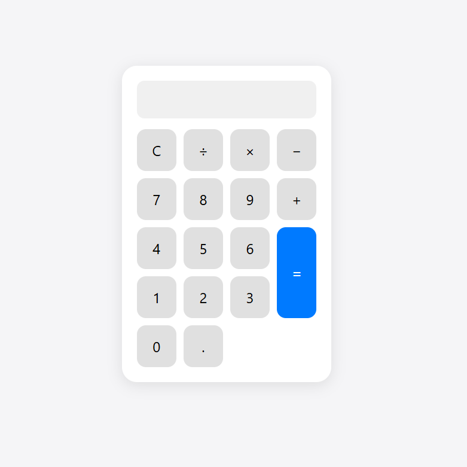

# Simple Calculator

A clean and minimal calculator built with HTML, CSS, and JavaScript.

## Features
- Basic arithmetic (+ − × ÷)
- Clear button
- Simple responsive UI

## Run locally
Open `index.html` in your browser.

## Screenshot

## License
MIT